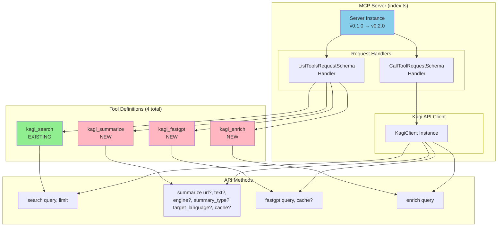
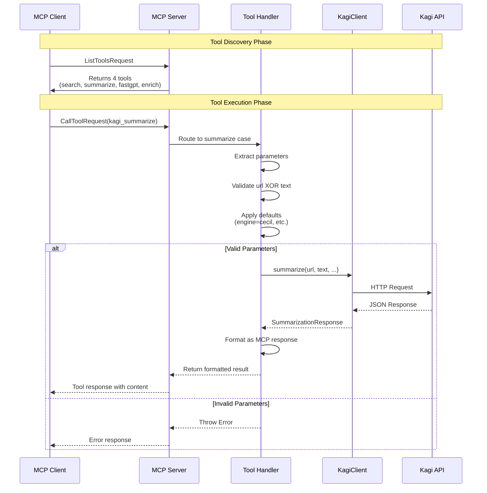
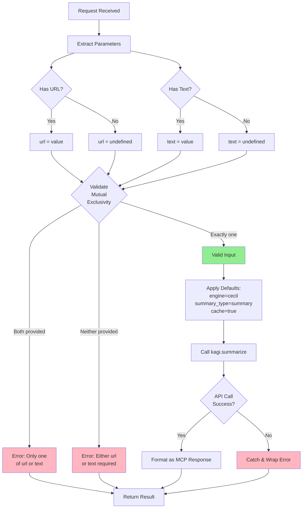
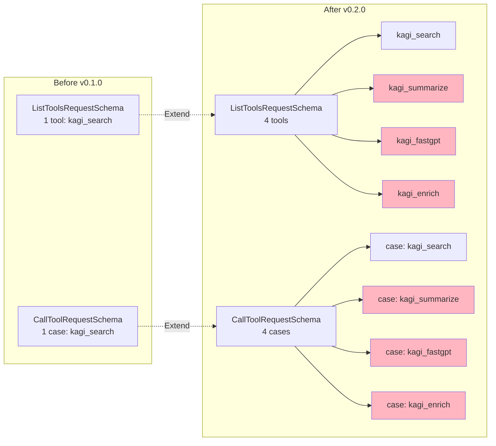
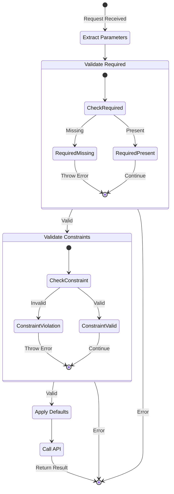
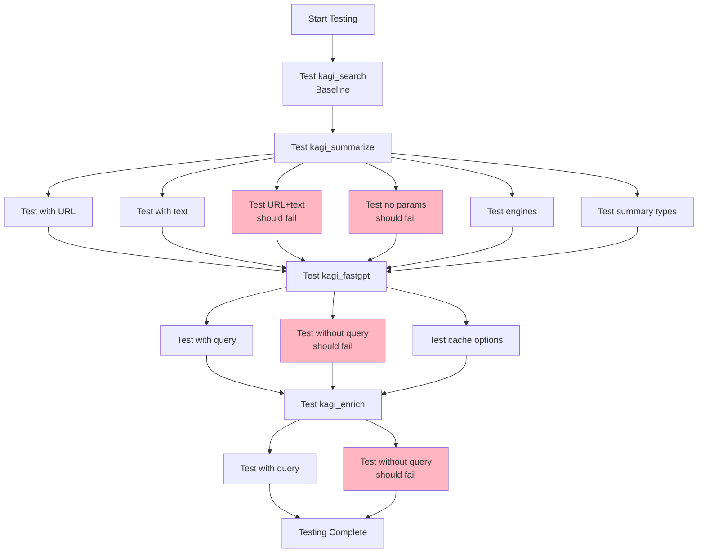
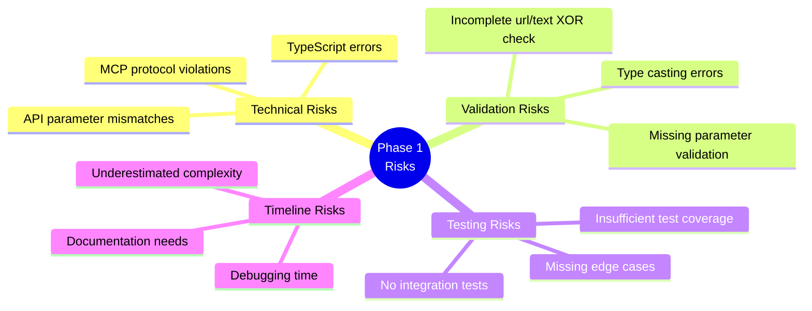

# Phase 1 Architecture Diagram

## System Overview



## Tool Implementation Flow



## Data Flow for kagi_summarize



## Code Structure Changes



## Parameter Validation Logic



## Testing Flow



## Implementation Complexity

| Tool | Parameters | Validation | Complexity |
|------|-----------|------------|------------|
| kagi_search | 2 (query, limit) | Basic | Low ⭐ |
| kagi_fastgpt | 2 (query, cache) | Basic | Low ⭐ |
| kagi_enrich | 1 (query) | Basic | Low ⭐ |
| kagi_summarize | 6 (url, text, engine, summary_type, target_language, cache) | Complex (XOR) | Medium ⭐⭐ |

## Risk Assessment



## Success Metrics

```mermaid
graph LR
    subgraph "Code Quality"
        Q1[No TypeScript<br/>errors]
        Q2[Consistent<br/>code style]
        Q3[Proper error<br/>handling]
    end
    
    subgraph "Functionality"
        F1[All tools<br/>discoverable]
        F2[All tools<br/>executable]
        F3[Validation<br/>works]
    end
    
    subgraph "Documentation"
        D1[Architecture<br/>documented]
        D2[API specs<br/>clear]
        D3[Testing guide<br/>complete]
    end
    
    Q1 --> Success[Phase 1<br/>Complete]
    Q2 --> Success
    Q3 --> Success
    F1 --> Success
    F2 --> Success
    F3 --> Success
    D1 --> Success
    D2 --> Success
    D3 --> Success
    
    style Success fill:#90EE90